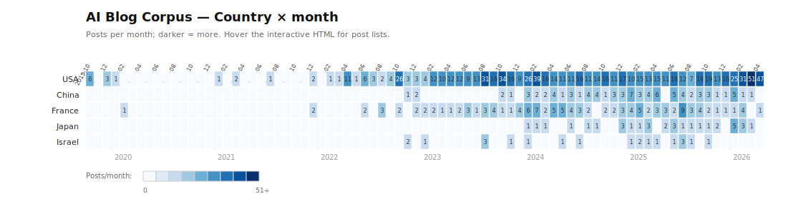
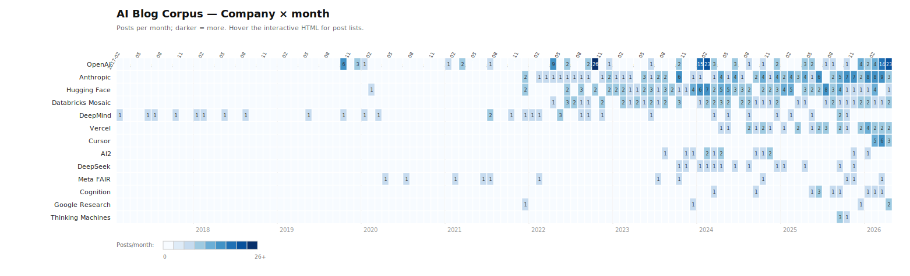

# AI Blog Corpus (v2)

A cross-indexed library of research and engineering blog posts from **12 AI organizations**, categorized around **8 focus areas** as the primary axis, with secondary cross-references by company, year, contribution type, and technique.

## v2 scope

**IN-SCOPE** — core model training, post-training & fine-tuning, alignment & safety, interpretability, evaluations, quantization/efficiency, agentic systems, harness & context engineering.

**OUT-OF-SCOPE** (v2 filter) — inference optimization (speculative decoding, KV cache, Flash Attention internals), kernel work (CUDA/Triton), hardware benchmarks (H100/Gaudi comparisons), general serving infra, applied product stories without methodology.

## Stats

- **1360 in-scope posts** across **19 organizations** from **6 countries**
- Organizations: Anthropic, OpenAI, Databricks Mosaic AI, Cursor, Vercel, Cognition, Thinking Machines, Google Research, Google DeepMind, Meta FAIR, Hugging Face, Allen Institute for AI (AI2), DeepSeek, **Sakana AI**, **Qwen (Alibaba)**, **Mistral**, **AI21 Labs**, **LangChain**, **Moonshot (Kimi)**
- Countries: USA (906), France (186), Israel (116), China (83), Japan (35), UK (34)
- **8 focus areas** × 6 axes of secondary categorization (company, country, year, contribution type, technique, subcategory)

## Artifacts

1. **Google Sheet** — [Master Index](https://docs.google.com/spreadsheets/d/1td1T6wCEnw4EeG05I_hH1dK1aNkLR5HJZZ-4jr-Du9A/edit) (source of truth, one row per post; filter by `focus_area`, `company`, `year`, etc.)
2. **Markdown library** (this repo) — canonical 3-5 bullet summaries organized by focus area, cross-linked to company/year/technique indexes
3. **Google Doc synthesis** — opinionated executive narrative (cross-company themes, standout posts, divergences, gaps)
4. **[Interactive temporal heatmap](visualizations/heatmap.html)** — focus area × month and company × month heatmaps with hover drill-down, plus stacked-area trends over time

## Heatmap preview






Open **[visualizations/heatmap.html](visualizations/heatmap.html)** for the interactive version (hover for post lists, click legend to toggle series).

## Directory structure

```
by-focus-area/        # CANONICAL — 8 focus-area files; full per-post entries organized by subcategory H2 sections
by-subcategory/       # Cross-reference — 69 files, one per subcategory (flat)
by-company/           # Cross-reference — 19 company files
by-country/           # Cross-reference — 6 country files (USA, China, France, UK, Japan, Israel)
by-contribution-type/ # Cross-reference by contribution kind
by-year/              # Cross-reference by publish year
by-technique/         # Cross-reference by technique tag (SAE, MoE, RLHF, etc.)
visualizations/       # Interactive heatmap dashboard (HTML) + SVG previews
_data/                # Source CSVs + scripts
index.md              # Master nav (focus area → subcategory → entries)
```

Each post has a unique ID (`{company}-{track}-{slug}`) and appears as a full entry in exactly one `by-focus-area/*.md` file. Every other file cross-references via the ID anchor.

## Focus areas and subcategories

Each post is tagged with a **focus area** (primary) and a **subcategory** (secondary, 1-of-many within the focus area). Both are columns in the Sheet and are used to organize the markdown.

1. **pretraining-and-architecture** (271) — foundation model releases · architectures (MoE/SSMs/attention variants) · multimodal pretraining · scaling laws & training dynamics · data & tokenization · training stack · research techniques & methods · societal impact & deployment studies
2. **post-training-and-fine-tuning** (34) — RLVR · classic RLHF · direct preference (DPO/KTO/ORPO/SimPO) · SFT & instruction tuning · distillation
3. **alignment-and-safety** (95) — responsible scaling & policy · constitutional & self-critique · deceptive alignment · dangerous-capability evals · red-teaming & jailbreaking · scalable oversight · reward hacking & sycophancy · general safety research
4. **interpretability** (17) — SAEs & dictionary learning · circuits & mechanistic · steering & intervention · feature viz & probing · attention & induction heads
5. **evals-and-benchmarks** (77) — agent evals · coding evals · reasoning evals · judge models & methodology · eval systems · domain-specific · benchmark critique · multimodal evals
6. **quantization-and-efficiency** (20) — training-time quantization · post-training quantization · parameter-efficient (LoRA/PEFT) · pruning & sparsity
7. **agentic-systems** (112) — coding agents · multi-agent · computer/browser use · tool use · enterprise agents · embodied/simulation · traces & observability · agent design & patterns · general agentic systems
8. **harness-and-context-engineering** (69) — MCP & tool protocols · long-running harnesses · context engineering · scaffolding · agent skills · prompt caching · Codex/Sora/Atlas case studies

**Total subcategories:** ~56 across all 8 focus areas. See `by-subcategory/` for a flat index.

## Contributing companies

| Company | Posts | Primary strengths |
|---|---|---|
| OpenAI | 187 | System cards, agent/harness engineering, research breadth |
| Anthropic | 125 | Alignment, interpretability, harness/context engineering, Claude Code |
| Hugging Face | 115 | Applied engineering, reproductions, open models, datasets |
| Databricks Mosaic AI | 76 | DBRX, MPT, training infra transparency, enterprise agents |
| Meta FAIR | 61 | Llama, SAM, V-JEPA, multimodal, embodied AI |
| Google DeepMind | 34 | AlphaFold/Geometry/Proof, Gemini safety, foundation for science |
| Vercel | 32 | Agent infrastructure, v0, AI SDK |
| AI2 | 18 | OLMo, Tulu, Dolma — full-stack open-source |
| Cursor | 14 | Composer, coding agent research, agent sandboxing |
| DeepSeek | 13 | V3/R1/MoE technical reports, every release is methodologically dense |
| Cognition | 11 | SWE-bench, Devin engineering, Agent Trace |
| Google Research | 5 | (Most non-LLM work filtered out in v2) |
| Thinking Machines | 4 | Connectionism research (Defeating Nondeterminism, LoRA Without Regret, On-Policy Distillation, Modular Manifolds) |

## ID convention

`{company-abbrev}-{track-abbrev}-{slug}`

| Company | Abbrev |
|---|---|
| Anthropic | `ant` |
| OpenAI | `oai` |
| Databricks Mosaic | `dbx` |
| Cursor | `cur` |
| Vercel | `vcl` |
| Cognition | `cog` |
| Thinking Machines | `tm` |
| Google Research | `gr` |
| Google DeepMind | `dm` |
| Meta FAIR | `meta` |
| Hugging Face | `hf` |
| AI2 | `ai2` |
| DeepSeek | `dsk` |

Track: `r` (research), `e` (engineering), `a` (applied).

## Iteration workflow

- **Add a source** → drop rows into the Sheet, re-run `_data/generate_markdown_v2.py`.
- **Re-categorize** → edit `focus_area` column in Sheet, re-run the generator.
- **Rewrite a summary** → edit the entry in `by-focus-area/*.md` (canonical); cross-refs still resolve.
- **New axis** → add a column, add `by-{axis}/` dir, extend generator.
- **Refresh** → weekly cron: poll feeds, diff against Sheet, summarize + categorize new posts.

## Scripts (all in `_data/`)

- `parse_feeds.py` — v1 RSS/sitemap parsers
- `enumerate_tier1.py` — v2 Tier 1 crawler (Google Research, Meta, HF, DeepSeek)
- `assign_focus_area.py` — per-post focus-area classifier
- `consolidate_v2.py` — merges all enum files, applies v2 filter + classification
- `heuristic_tag.py` — legacy tag assignments (kept for compatibility)
- `generate_markdown_v2.py` — writes all markdown (by-focus-area canonical)
- `upload_sheet.py` — pushes master.csv to the Google Sheet

## Known limitations (v2)

1. **Classification is heuristic.** 271 posts land in pretraining-and-architecture; ~40% of those could fit better in post-training or other areas once summaries are available.
2. **Per-post 3-5 bullet summaries pending.** Every entry currently shows "Summary pending" — the main remaining work.
3. **Meta / DeepMind / Google Research titles are slug-derived** (Wayback-based enumeration). Can be enriched by fetching post pages via headless browser.
4. **AI2 and DeepMind under-representation.** Tight filter currently keeps 18 and 34 respectively; looser rules could bring these to 80-100 each.

## v1 → v2 changes

- Primary axis flipped from `by-company/` (canonical in v1) to `by-focus-area/` (canonical in v2)
- Added 5 frontier labs: DeepMind, Meta FAIR, Hugging Face, AI2, DeepSeek
- Tightened scope filter to drop inference/kernel/serving-infra posts (~99 v1 posts re-classified as out-of-scope in v2)
- `by-technical-domain/` retired (superseded by `by-focus-area/`)
- Sheet has new columns: `focus_area`, `dropped_in_v2`
